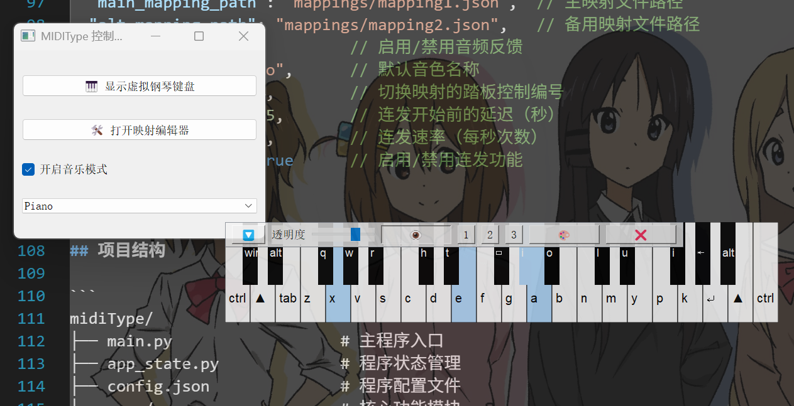

# MidiType

将MIDI键盘映射为电脑键盘输入的工具。通过接入MIDI键盘，您可以使用钢琴键盘进行打字、编程或游戏操作。


## 功能特点

- **实时MIDI键盘映射**：将MIDI键盘按键映射为计算机键盘按键
- **双重映射方案**：支持通过踏板快速切换两套不同的映射方案
- **可视化界面**：半透明钢琴界面，显示当前映射和按键状态
- **自定义映射**：完全可自定义的键位映射，支持普通字符键、功能键和组合键
- **连发功能**：支持按键连发功能，可配置延迟和速率
- **音频反馈**：可选择启用音频反馈，按下按键时播放对应的钢琴音符

## 系统要求

- Windows、macOS 或 Linux 操作系统
- Python 3.6 或更高版本
- 至少一个MIDI输入设备（键盘、控制器等）

## 安装步骤

1. 克隆此仓库到本地：
   ```bash
   git clone https://github.com/yourusername/midiType.git
   cd midiType
   ```

2. 安装依赖项：
   ```bash
   pip install mido python-rtmidi pynput pygame pyqt5
   ```

3. 连接您的MIDI键盘到计算机

4. 运行程序：
   ```bash
   python main.py
   ```

## 使用说明

### 基本操作

1. 运行程序后，会自动检测并连接到第一个可用的MIDI输入设备
2. 窗口中将显示一个半透明的钢琴键盘界面，每个键上标有对应的映射字符
3. 弹奏MIDI键盘时，对应的计算机键将被触发，如同正常键盘输入
4. 踩下踏板（默认为Control 64）可切换到备用映射方案，松开回到主映射



### 自定义映射

编辑 `mappings` 目录下的JSON文件来自定义映射：
- `mapping1.json` - 主映射方案
- `mapping2.json` - 备用映射方案（踏板激活时使用）

映射格式为：
```json
{
  "60": "a",   // MIDI音符号码 60 映射到键盘的 'a' 键
  "61": "b",
  "62": "ctrl+c"  // 支持组合键
}
```

> **注意**：目前通过GUI界面的映射编辑器功能正在开发中，暂时需要直接编辑JSON文件来修改映射。

### 音色文件

程序使用WAV格式的音频文件作为MIDI键盘的声音反馈。音色文件存储在以下位置：

```
assets/sounds/piano_music/
```

#### 自定义音色

您可以添加自己的音色文件，遵循以下命名规则：
1. 文件格式必须为WAV格式
2. 文件名格式：`[乐器名称]_[音符名称].wav`
   - 例如：`Piano_C4.wav`、`Guitar_A#3.wav`

添加新音色的步骤：
1. 在`assets/sounds/`目录下创建新的乐器文件夹，如`guitar_music`
2. 将WAV文件放入该目录，确保命名符合上述规则
3. 音色包不需要包含完整的88个音符，程序会自动加载存在的音频文件
4. 启动程序后，在主窗口的下拉菜单中选择新添加的音色即可

> **注意**：程序会自动扫描 `assets/sounds/` 目录下的所有文件夹，只要包含有效的WAV文件（符合命名规则）就会被识别为可用音色。音色名称从文件夹名称中提取（例如 piano_music -> Piano）。

> **提示**：需要确保文件名中正确使用音符名称（如C4、D#5等），否则程序将无法识别。

### 配置选项

编辑 `config.json` 调整程序设置：

```json
{
  "main_mapping_path": "mappings/mapping1.json",  // 主映射文件路径
  "alt_mapping_path": "mappings/mapping2.json",   // 备用映射文件路径
  "music_mode": true,         // 启用/禁用音频反馈
  "instrument": "Piano",      // 默认音色名称
  "pedal_control": 64,        // 切换映射的踏板控制编号
  "repeat_delay": 0.35,       // 连发开始前的延迟（秒）
  "repeat_rate": 10.0,        // 连发速率（每秒次数）
  "repeat_enabled": true      // 启用/禁用连发功能
}
```

## 项目结构

```
midiType/
├── main.py                  # 主程序入口
├── app_state.py             # 程序状态管理
├── config.json              # 程序配置文件
├── core/                    # 核心功能模块
│   ├── audio_player.py      # 音频播放模块
│   ├── midi_dispatcher.py   # MIDI消息处理模块
│   ├── repeater.py          # 按键重复功能模块
│   └── mapping_manager.py   # 映射管理模块
├── gui/                     # 图形界面模块
│   ├── main_window.py       # 主窗口
│   └── piano_overlay.py     # 钢琴键盘可视化界面
├── utils/                   # 工具函数
│   ├── config_loader.py     # 配置加载工具
│   └── keycode_utils.py     # 键码转换工具
├── assets/                  # 资源文件
│   └── sounds/              # 音频资源
│       └── piano_music/     # 钢琴音色文件（WAV格式）
└── mappings/                # 映射配置文件
    ├── mapping1.json        # 主映射方案
    └── mapping2.json        # 备用映射方案
```

## 问题解决

如果遇到以下问题：

1. **找不到MIDI设备**：
   - 确保MIDI设备已正确连接并被系统识别
   - 某些USB MIDI接口可能需要安装驱动程序

2. **按键无响应**：
   - 检查映射配置文件格式是否正确
   - 尝试使用MIDI监视工具确认设备是否正在发送MIDI消息

3. **程序崩溃**：
   - 检查Python版本是否兼容
   - 确保所有依赖项已正确安装

4. **没有声音**：
   - 确认`music_mode`已在config.json中设置为true
   - 检查音频文件是否存在于正确位置
   - 确保命名格式符合要求
   

## 贡献指南

欢迎提交Pull Request或创建Issue来改进此项目。

## 开发计划

- [x] 基本键盘映射功能
- [x] 踏板切换映射方案
- [x] 半透明钢琴键盘界面
- [x] 音频反馈功能
- [ ] 通过GUI界面配置映射（开发中）
- [ ] 多设备支持
- [ ] 热键切换配置

## 致谢

感谢所有为此项目提供支持和帮助的人。

## 许可证

本项目采用 MIT 许可证。

```
MIT License

Copyright (c) 2025 NikolaStarx

Permission is hereby granted, free of charge, to any person obtaining a copy
of this software and associated documentation files (the "Software"), to deal
in the Software without restriction, including without limitation the rights
to use, copy, modify, merge, publish, distribute, sublicense, and/or sell
copies of the Software, and to permit persons to whom the Software is
furnished to do so, subject to the following conditions:

The above copyright notice and this permission notice shall be included in all
copies or substantial portions of the Software.

THE SOFTWARE IS PROVIDED "AS IS", WITHOUT WARRANTY OF ANY KIND, EXPRESS OR
IMPLIED, INCLUDING BUT NOT LIMITED TO THE WARRANTIES OF MERCHANTABILITY,
FITNESS FOR A PARTICULAR PURPOSE AND NONINFRINGEMENT. IN NO EVENT SHALL THE
AUTHORS OR COPYRIGHT HOLDERS BE LIABLE FOR ANY CLAIM, DAMAGES OR OTHER
LIABILITY, WHETHER IN AN ACTION OF CONTRACT, TORT OR OTHERWISE, ARISING FROM,
OUT OF OR IN CONNECTION WITH THE SOFTWARE OR THE USE OR OTHER DEALINGS IN THE
SOFTWARE.
```

详细信息请查看 [LICENSE](LICENSE) 文件。
